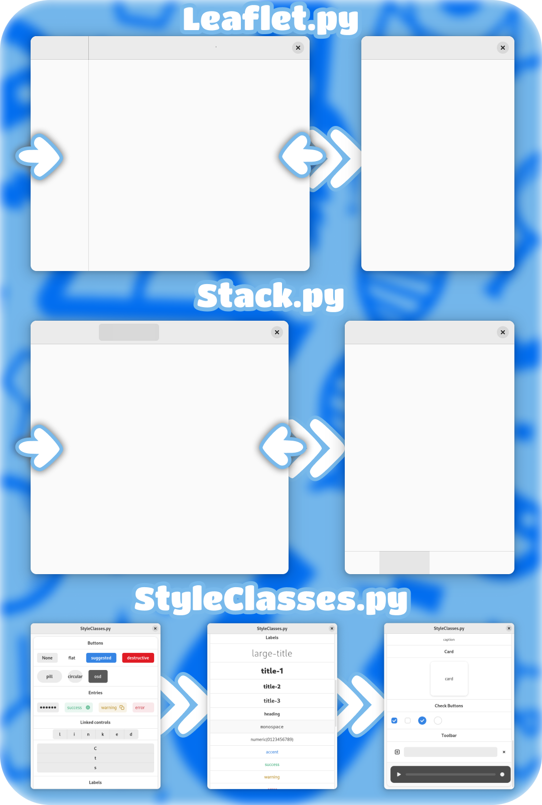

 # LibAdwaita python example code
Hello, these are small projects created in python to make it easier for you to create an application on LibAdwaita. When I started creating my application, I realized that there are few examples and documentation for creating applications on the Internet, and there are even fewer examples for the Python language. Therefore, I decided to make small projects and put them in the public domain. Over time, I will add more widgets. My code is not professional, do not judge strictly.

# What is already there?
На данный момент есть 3 файла в которых находятся такие темы:
 - Leaflet.py - Leaflet;
 - Stack.py - Stack;
 - StyleClasses.py - Style Classes;

## Screenshots

